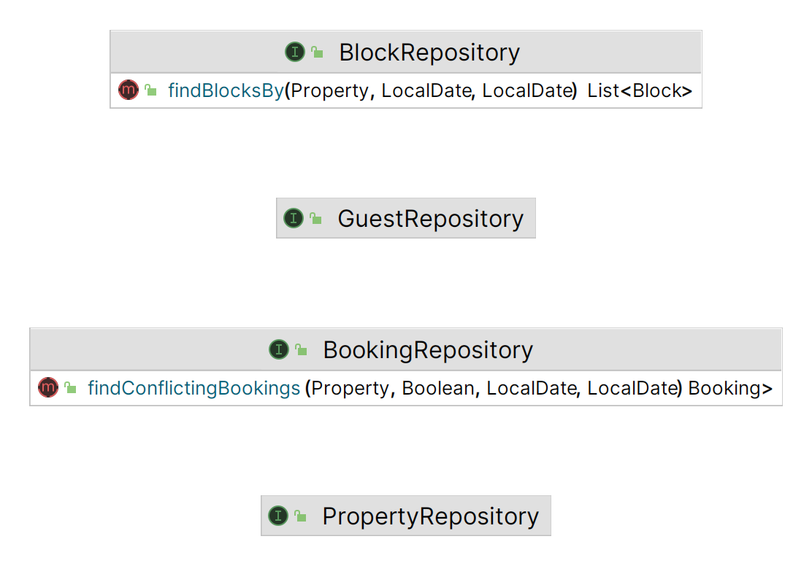

= System Architecture

== Overview

The system was developed using a three-tier architecture.
This architectural pattern separates the application into three interconnected components or layers:

* Presentation Layer (Controller):

The top layer is the presentation layer, which is responsible for handling the first level of API requests.
The Controller receives HTTP requests, processes them, and interacts with the Service layer to perform the necessary actions.

* Business Logic Layer (Service):

The middle layer is the business logic layer, also known as the service layer.
This layer contains the application's business logic, including the processing and coordination of tasks.
The Service layer receives requests from the Controller, performs the necessary business logic, and communicates with the Repository to fetch or persist data.

* Data Access Layer (Repository):

The bottom layer is the data access layer, responsible for interacting with the data storage or database.
The Repository handles the storage and retrieval of data from a database or other data sources.
It abstracts the data access details from the Service layer.

This architecture promotes separation of concerns and modularity.
Each layer has a specific responsibility, making the application more maintainable and scalable.
Additionally, it enables easier testing of individual components and allows for flexibility in changing the underlying data storage without affecting the rest of the application.

The three-tier architecture is a common pattern in web application development, and it aligns with the principles of good software design and separation of concerns.

== Class Diagram

The following class diagrams show the main packages related to the architecture.
They are controller, service, and repository.
The package naming directly represents the architecture layers.

==== Controller

The classes in the `controller` package implement the Controller layer.
The code core is implemented in BaseController using Generics.
This approach makes use of Object Orientation and Java language features to excel the code reuse.

The specific code for **cancel** and **rebook** is implemented in the derived class BookingController.

=== Service

The classes in the `service` package implement the Service layer.
The service layer is responsible for translating the DTO (Data Transfer Objects) used by the Controller layer to JPA (Java Persistence API) entities used by the Repository layer.
The translation itself is implemented using the helper library https://mapstruct.org[MapStruct].

The DTO classes are in the package `dto`.
The model classes are in the package `model`.

NOTE: To avoid exposing the model classes to the Controller layer, the `BaseController` uses of the interface `DtoService`, which references only `dto` classes.
The interface implementation is done by `BaseService`, which is a Java generic of both sides `dto` and `model`.

The code core is implemented in BaseService using Generics.
This approach makes use of Object Orientation and Java language features to excel the code reuse.

The specific code for saving is implemented in the respective derived class BookingService and BlockService.
Those classes have specific business logic to have date ranges and date intersection.

image::service-diagram.png[]

=== Repository

The interfaces in the `repository` package implement the Repository layer.
The repository layer has one interface per model.
Each interface extends `JpaRepository<T, Long>`, where T is the corresponding model.

The interface `BlockRepository` declares the `findBlocksBy`.
This method aims to find blocks that intersect with a booking date range.

The interface `BookingRepository` declares the `findConflictingBookings`.
This method aims to find bookings that intersect with a booking date range.

== Sequence Diagrams

The sequence diagrams show the handling of API requests by the internal layers, Controller, Service, and Repository.

=== Handling a POST request

image::save-sequence.png[]

=== Handling a GET request to fetch all

image::getall-sequence.png[]

=== Handling a GET request to fetch a specific object

image::get-sequence.png[]

=== Handling an PUT request

=== Handling an DELETE request

